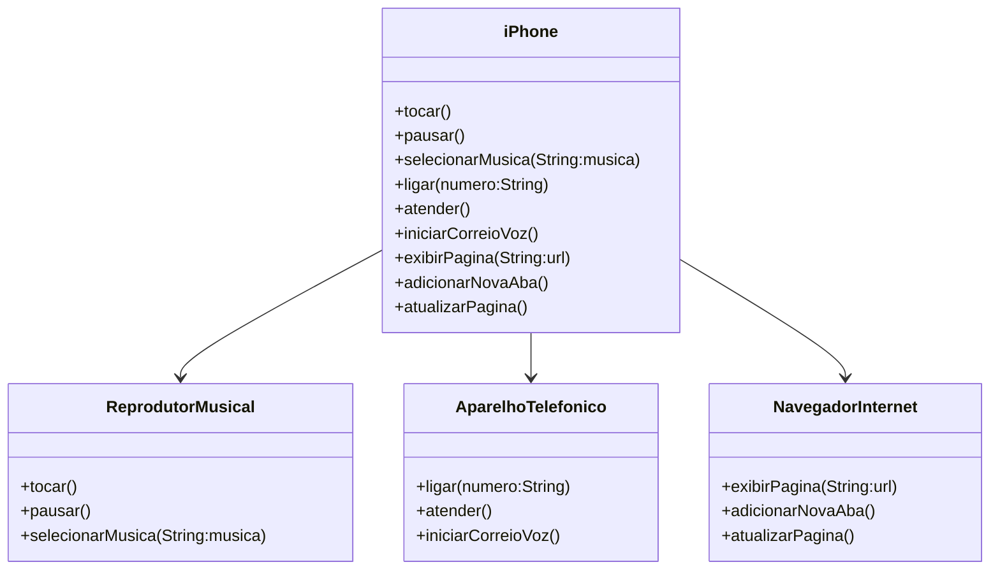

# 📌 Diagrama UML - Modelagem do iPhone
O diagrama UML abaixo representa a estrutura do componente **iPhone**, destacando suas funcionalidades organizadas por interfaces. Cada interface define um conjunto específico de comportamentos, garantindo a separação de responsabilidades e facilitando a manutenção e a expansão do código.

**ReprodutorMusical** 🎵
- Métodos: `tocar()`, `pausar()`, `selecionarMusica(String:musica)`.

**AparelhoTelefonico** 📞
- Métodos: `ligar(String:numero)`, `ateder()`, `iniciarCorreioVoz()`.

**NavegadorInternet** 🌍
- Métodos: `exibirPagina(String:url)`, `adicionarNovaAba()`, `atualizarPagina()`.

A classe **iPhone** implementa essas três interfaces, garantindo que o dispositivo seja capaz de executar funções musicais, realizar chamadas telefônicas e navegar na internet.

